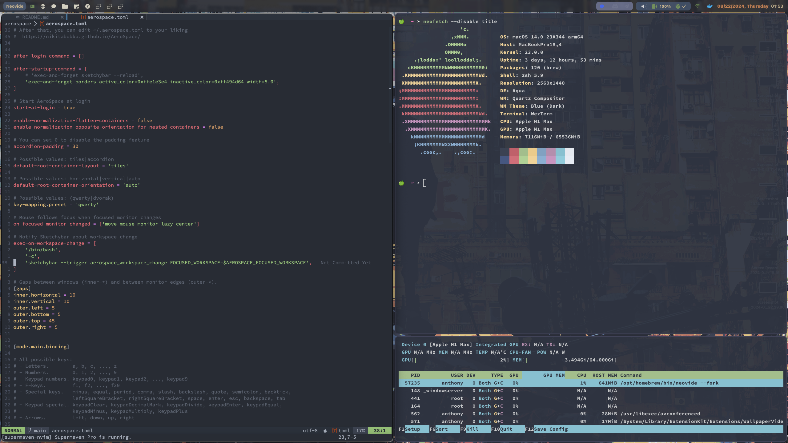
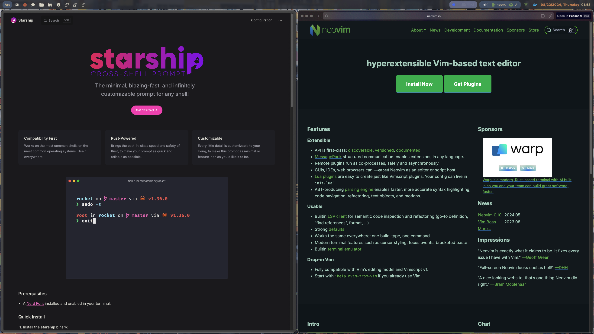

<h1 style="color:#03ff85">🐼 Dotfiles</h1>
<h3 style="color:#A3BE8C">Personal dotfiles repository for macOS. For my personal records.</h3>

## Description

+ **OS**: MacOS
+ **WM**: [AeroSpace](https://github.com/nikitabobko/AeroSpace)
+ **Terminal**: [WezTerm](https://wezfurlong.org/wezterm/) or [Warp](https://www.warp.dev/)
+ **Shell**: [zsh](https://www.zsh.org/)
+ **Shell Prompt**: [Starship](https://starship.rs/)
+ **Editor**: [Neovim](https://neovim.io/) with [Neovide](https://neovide.dev)
+ **Browser**: [Arc](https://arc.net/)
+ **Notes**: [Obsidian](https://obsidian.md/) and [Notion](https://www.notion.so/)
+ **Top Bar**: [Sketchybar](https://github.com/KaizIqbal/SketchyBar)
+ **Music**: [Spotify](https://www.spotify.com/) with themeing [Spicetify-cli](https://github.com/khanhas/spicetify-cli)
+ **Search**: [Raycast](https://www.raycast.com/)
+ **ls Replacement:** [eza](https://github.com/eza-community/eza)

## Fonts

- [Hack Nerd Font](https://github.com/ryanoasis/nerd-fonts/tree/master/patched-fonts/Hack)
- [Fira Code](https://github.com/tonsky/FiraCode)
- [JetBrains Mono](https://www.jetbrains.com/lp/mono/)
- [Source Code Pro](https://github.com/adobe-fonts/source-code-pro)

## Installation **(This script only for my personal use)**
```bash
./install.sh
```

## TODO
- [x] Notion Calendar Plugin
- [x] Sketchybar Config
- [ ] Setup 1Password Docs
- [ ] Setup Obsidian Docs
- [ ] Setup Raycast Docs

## Screenshots


